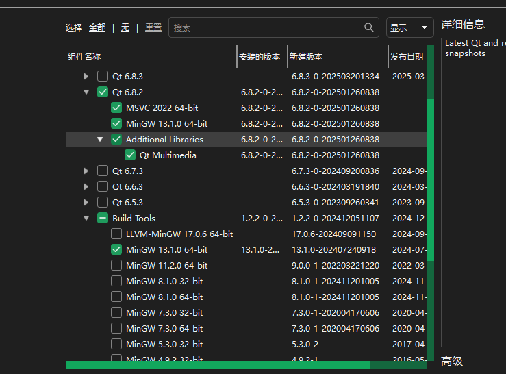
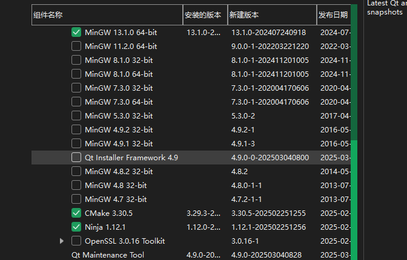
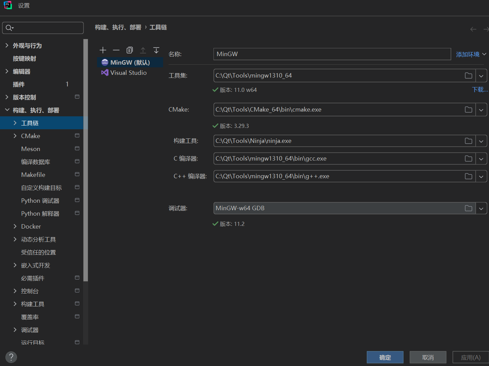
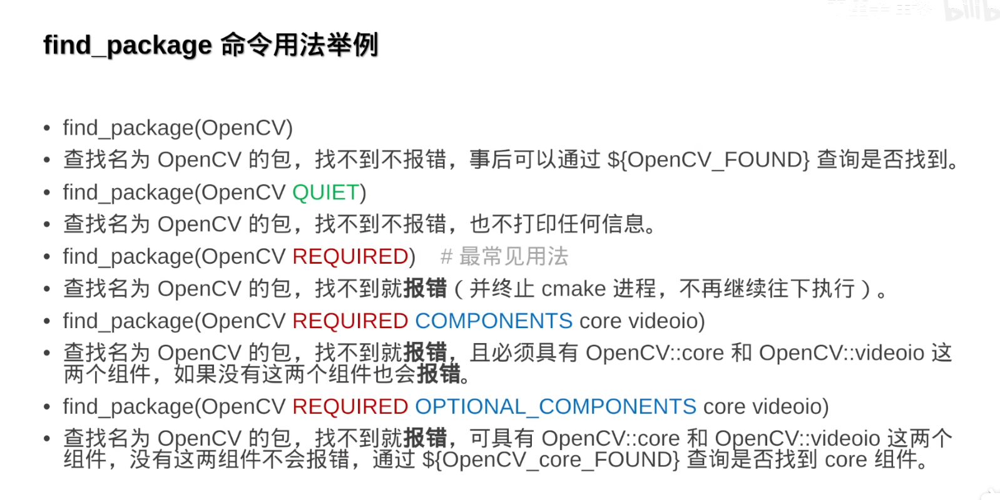

## 使用Clion Cmake 开发现代c++程序

### 安装Clion
### 安装Qt6.8
- [ ] qt的安装工具中选上msvc的库->生成仅用于Windows的程序(可选)

- [x] 选择mingw工具链，勾选cmake，ninja生成器



### 配置部分
#### clion部分，手动指定一下cmake的位置，我们使用qt提供的cmake和ninja
手动配置一下mingw的工具链


#### 使用CMakePresets.json指定qt的位置，这样项目在大部分机器上都不同配置太多了，而且兼容vscode
这个文件放在项目的根目录就可以了，我这里写了在linux运行使用的presets，linux比较方便，因为可以直接找到cmake脚本，windows上比较杂乱，我们使用这个presets指定就可以避免每次配置环境了
```json
{
  "version": 3,
  "cmakeMinimumRequired": {
    "major": 3,
    "minor": 20,
    "patch": 0
  },
  "configurePresets": [
    {
      "name": "base",
      "hidden": true,
      "binaryDir": "${sourceDir}/build",
      "cacheVariables": {
        "CMAKE_EXPORT_COMPILE_COMMANDS": "ON"
      },
      "cmakeExecutable": "C:/Qt/Tools/CMake_64/bin/cmake.exe"
    },

    {
      "name": "windows-mingw",
      "inherits": "base",
      "generator": "Ninja",
      "cacheVariables": {
        "CMAKE_BUILD_TYPE": "Debug",
        "CMAKE_PREFIX_PATH": "C:/Qt/6.8.2/mingw_64;${sourceDir}/3rdParty/TagLib_lib",
        "CMAKE_CXX_COMPILER": "C:/Qt/Tools/mingw1310_64/bin/g++.exe",
        "CMAKE_MAKE_PROGRAM": "C:/Qt/Tools/Ninja/ninja.exe"
      },
      "environment": {
        "PATH": "C:/Qt/6.8.2/mingw_64/bin;${sourceDir}/3rdParty/TagLib_lib/bin"
      },
      "condition": {
        "type": "equals",
        "lhs": "${hostSystemName}",
        "rhs": "Windows"
      }
    },
    {
      "name": "linux-default",
      "inherits": "base",
      "generator": "Unix Makefiles",
      "cacheVariables": {
        "CMAKE_BUILD_TYPE": "Debug"
      },
      "condition": {
        "type": "equals",
        "lhs": "${hostSystemName}",
        "rhs": "Linux"
      }
    }
  ],
  "buildPresets": [
    {
      "name": "mingw-debug",
      "configurePreset": "windows-mingw",
      "configuration": "Debug"
    },
    {
      "name": "linux-debug",
      "configurePreset": "linux-default",
      "configuration": "Debug"
    }
  ]
}
```
#### LSP部分，也就是智能提示
这部分通常需要在CMakeLists.txt中写

比如我这里include下的backends需要导入一些头文件，可能包含interface中的基类，或者是qt库的头文件
```Powershell 
├─include
│  ├─backends
│  ├─engine
│  └─interfaces
├─music_logo
│  └─data
├─settings
└─src
```
对于qt库的头文件，你必须把最后的link设置为PUBLIC，否则会没法暴露库的头文件，这样lsp会一直告诉你找不到头文件
```cmake
cmake_minimum_required(VERSION 3.20)
file(GLOB_RECURSE CORE_SOURCES
        include/*.h
        src/*.cpp
)

add_library(tray_music_core STATIC ${CORE_SOURCES})

target_include_directories(tray_music_core PUBLIC
        ${CMAKE_CURRENT_SOURCE_DIR}/include/interfaces
)

target_include_directories(tray_music_core PRIVATE
        ${CMAKE_CURRENT_SOURCE_DIR}/include/backends
        ${CMAKE_CURRENT_SOURCE_DIR}/include/engine
)

target_link_libraries(tray_music_core PUBLIC
        Qt6::Multimedia
)

```
对于根目录的CMakeLists.txt，其实就看项目结构了，可以把一些全局的东西写在这里，然后子模块是共享的
- MOC和RCC这个是可以写在外面的
- find_package写在根目录的CMakeLists中
- 使用add_subdirectory导入子模块就可以了
- qrc文件必须加入到最终的可执行文件，只要你执行了，不管是不是这个模块用了qrc，都必须加入，否则就会找不到

```cmake
cmake_minimum_required(VERSION 3.20)

set(CMAKE_CXX_STANDARD 17)
set(CMAKE_CXX_STANDARD_REQUIRED ON)
set(CMAKE_CXX_EXTENSIONS OFF)

set(CMAKE_AUTOMOC ON)
set(CMAKE_AUTORCC ON)

set(CMAKE_EXPORT_COMPILE_COMMANDS ON)

project(TrayMusicPlayer
        VERSION 0.1
        DESCRIPTION "Cross-platform Music Player with Core-UI Separation"
        LANGUAGES CXX
)

if(WIN32)
    if(MSVC)
        set(CMAKE_MSVC_RUNTIME_LIBRARY "MultiThreaded$<$<CONFIG:Debug>:Debug>")
    endif()
elseif(UNIX AND NOT APPLE)
    set(CMAKE_CXX_FLAGS "${CMAKE_CXX_FLAGS} -Wall -Wextra")
endif()

find_package(Qt6 REQUIRED COMPONENTS
    Multimedia
    Core
    Widgets
    Svg
)
add_subdirectory(core)
#add_subdirectory(services)
add_subdirectory(ui)
```

贴一下我的可执行文件的模块
```cmake
cmake_minimum_required(VERSION 3.20)

file(GLOB_RECURSE UI_SOURCES
        ${CMAKE_CURRENT_SOURCE_DIR}/src/*.cpp
        ${CMAKE_CURRENT_SOURCE_DIR}/include/*.h
        ${CMAKE_CURRENT_SOURCE_DIR}/*.qrc
)

qt_add_executable(TrayMusicPlayer
        MANUAL_FINALIZATION
        ${UI_SOURCES}
)

target_link_libraries(TrayMusicPlayer PUBLIC
        tray_music_core
        Qt6::Widgets
        Qt6::Svg
        Qt6::Core
)

target_include_directories(TrayMusicPlayer PUBLIC
        ${CMAKE_CURRENT_SOURCE_DIR}/include
)

if(WIN32)
    set_target_properties(TrayMusicPlayer PROPERTIES
            WIN32_EXECUTABLE TRUE
    )
endif()

qt_finalize_target(TrayMusicPlayer)
```

### 再顺便学习一下现代c++的工程风格

#### 项目结构推荐

`ProjectName/include/ProjectName/*.hpp`

`ProjectName/src/*.hpp`

#### CMakeLists.txt中写入include
这样可以让别的模块使用这个模块的头文件
```CMake
target_include_directories(projectname PUBLIC include)
```

#### 源码中写入带前缀路径的include
这样写防止与第三方库出现头文件名重复
```cpp
#include<path/header.hpp>
```

#### 编码格式
- 头文件
```cpp
#pragma once
namespace ProjectName{
    ---
}
```
- cpp文件
```cpp
#include <ProjectName/module.h>
namespace ProjectName{
    ---
}
```

#### 依赖其他子项目，则需要链接它

假设a依赖b
a的CMakeLists.txt:
```
target_link_libraries(a PUBLIC b)
```

b的CMakeLists.txt:
```
target_include_directories(b PUBLIC include)
```

PUBLIC有传染性，现在在a中也可以include进b的头文件了

#### 导入第三方库
直接拿b站up双笙子佯谬的视频截图，了解详细的可以去b站看他的视频

