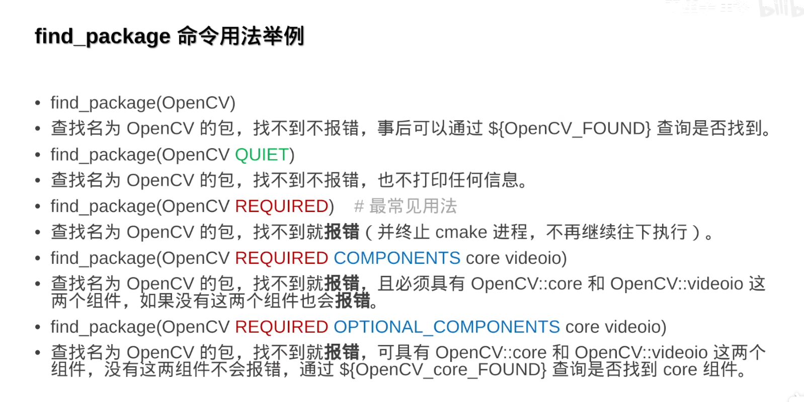

### 入门一下反人类的cmake

#### 项目结构推荐

ProjectName/include/ProjectName/*.hpp
ProjectName/src/*.hpp

#### CMakeLists.txt中写入include
```CMakeLists.txt
target_include_directories(projectname PUBLIC include)
```

#### 源码中写入带前缀路径的include
```cpp
#include<path/header.hpp>
```

#### 编码格式
- 头文件
```cpp
#pragma once
namespace ProjectName{
    ---
}
```
- cpp文件
```cpp
#include <ProjectName/module.h>
namespace ProjectName{
    ---
}
```

#### 依赖其他子项目，则需要链接它

假设a依赖b
a的CMakeLists.txt:
```
target_link_libraries(a PUBLIC b)
```

b的CMakeLists.txt:
```
target_include_directories(b PUBLIC include)
```

PUBLIC有传染性，现在在a中也可以include进b的头文件了

#### 导入第三方库
直接拿b站up双笙子佯谬的视频截图来了，了解详细的可以去b站看他的视频



#### qt的cmake指北

